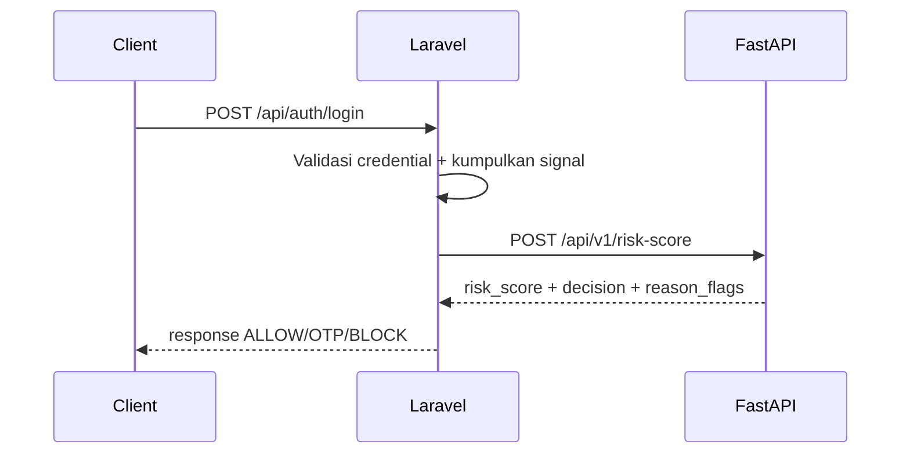

# AI Risk Engine

AI Risk Engine berada di service `fastapi-risk` dan dipanggil oleh Laravel saat proses login.

## Peran AI Risk Engine

- Menerima sinyal login dari Laravel.
- Menghasilkan `risk_score` dan `decision` (`ALLOW`, `OTP`, `BLOCK`).
- Memberikan reason flags untuk audit dan explainability.

## Flow Integrasi

## Signal Utama (Contoh)

| Signal | Kegunaan |
|---|---|
| `ip_risk_score` | Menilai reputasi IP |
| `is_vpn` | Deteksi jaringan anonim/proxy |
| `is_new_device` | Deteksi perangkat baru |
| `is_new_country` | Deteksi perubahan negara login |
| `failed_attempts` | Menilai intensitas gagal login |
| `request_speed` | Deteksi request pattern abnormal |

## Mapping Keputusan

| Kondisi | Tindakan |
|---|---|
| `decision=ALLOW` | Login dilanjutkan |
| `decision=OTP` | Sistem minta verifikasi MFA/OTP |
| `decision=BLOCK` | Login ditolak |

## Fallback Saat AI Tidak Tersedia

Jika FastAPI timeout/error, Laravel dapat menggunakan fallback scoring rule-based agar login flow tetap aman.

## Observability

- Log keamanan tersimpan di channel `security`.
- Reason flags disimpan untuk analisis insiden.
- Endpoint health FastAPI: `GET /health`.
