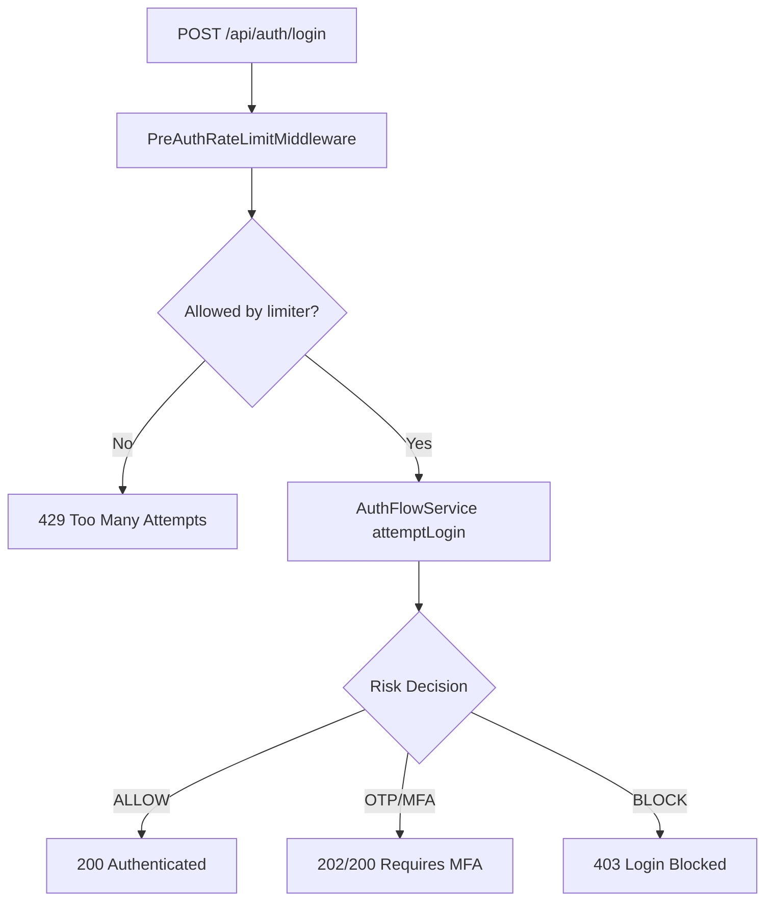
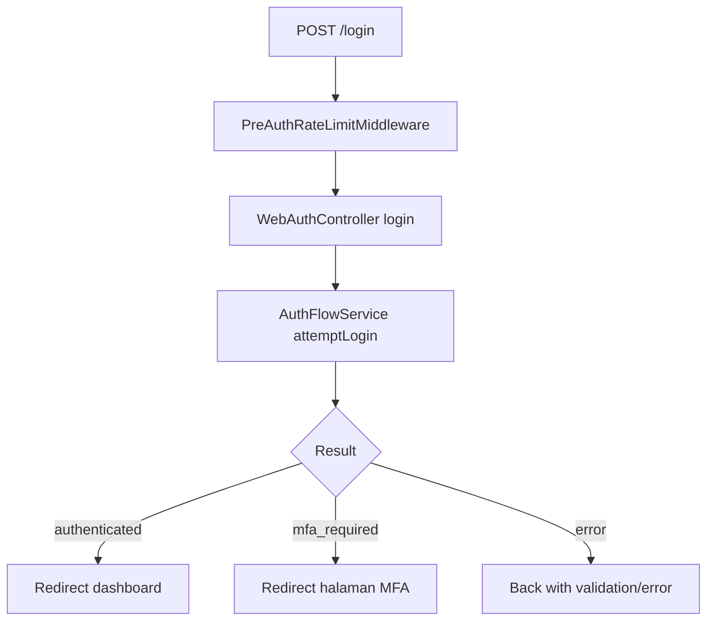

# Flow Autentikasi

Halaman ini merangkum alur autentikasi dari dua jalur: API dan Web.

## Flow API Login

## Flow Web Login

## Flow MFA Verify

| Channel | Endpoint/Route | Keluaran |
|---|---|---|
| API | `POST /api/auth/mfa/verify` | JSON success/error |
| Web | `POST /auth/mfa/verify` | Redirect success/error |

## Flow Reset Password

1. Request reset link (`forgot-password`).
2. Validasi token reset.
3. Submit password baru.
4. Login ulang dengan kredensial baru.

## Titik Kontrol Keamanan

- Rate limit pre-auth.
- Verifikasi captcha (jika mode captcha aktif).
- Risk assessment AI/fallback.
- MFA throttle.
- Session fingerprint checks.
