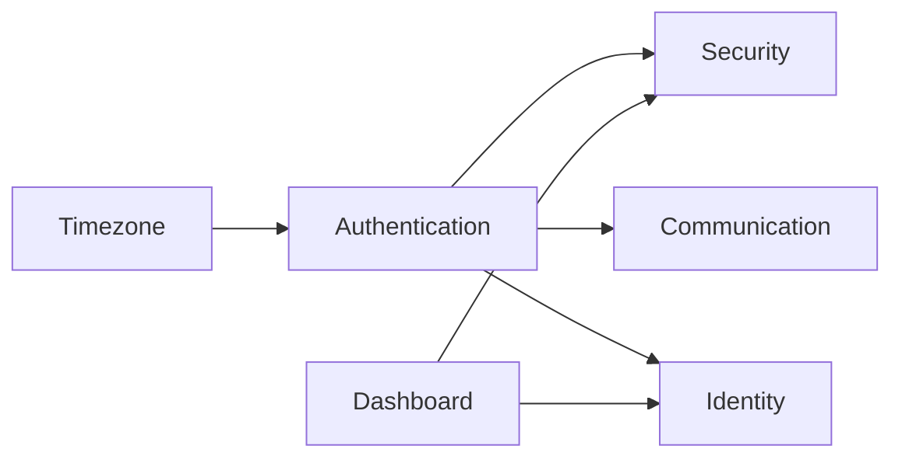

# Arsitektur Modular Laravel

Backend menggunakan pendekatan modular di `app/Modules` agar domain terpisah jelas dan mudah dikembangkan.

## Tujuan Arsitektur Modular

- Memisahkan domain logic per bounded context.
- Mengurangi coupling antar fitur.
- Mempermudah testing, onboarding, dan scaling tim.

## Peta Modul

| Modul | Tanggung Jawab Utama | Komponen Umum |
|---|---|---|
| Authentication | Login, MFA, reset password, logout | Controller, Service, Middleware |
| Security | Risk signal, device fingerprint, blocking/rate limit | Service, Middleware, Model |
| Identity | Data profil pengguna dan preferensi | Controller, Model, View |
| Authorization | Role-based access dan guard akses | Middleware, Policy/Service |
| Timezone | Sinkronisasi zona waktu user/session | Service, Middleware |
| Communication | Pengiriman OTP/notifikasi | Notification, Queue integration |
| Dashboard | Halaman admin dan monitoring | Controller, Blade/View |

## Pola Interaksi Antar Modul



Prinsip yang dipakai:

1. Modul berkomunikasi lewat service layer, bukan akses langsung lintas model tanpa batas.
2. Middleware menangani concern lintas domain (rate limit, fingerprint, session guard).
3. Route dipisah per modul (`web.php`/`api.php`) untuk menjaga batas konteks.

## Struktur Direktori Tingkat Tinggi

```text
app/Modules/
  Authentication/
  Security/
  Identity/
  Authorization/
  Timezone/
  Communication/
  Dashboard/
```

## Dampak ke Tim

- Developer baru lebih cepat memahami area kerja.
- Refactor lebih aman karena domain boundary jelas.
- Test suite lebih fokus per modul.
