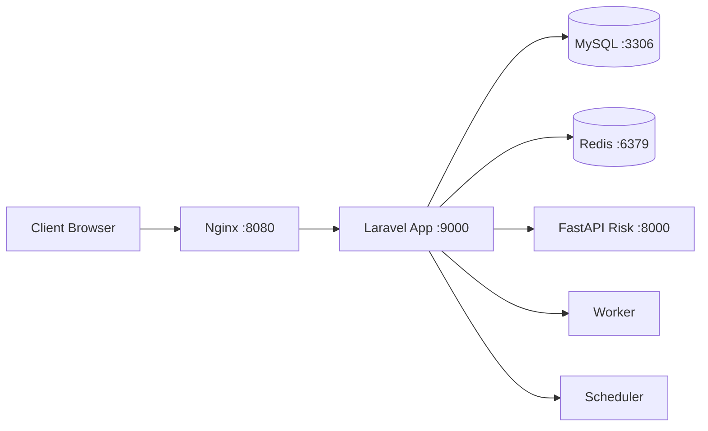

# Arsitektur Docker

Sistem berjalan sebagai beberapa service terpisah dalam satu network internal Docker.

## Topologi Service



## Ringkasan Per Service

| Service | Fungsi |
|---|---|
| `nginx` | Reverse proxy publik ke Laravel |
| `app` | Aplikasi Laravel utama |
| `worker` | Menjalankan queue jobs |
| `scheduler` | Menjalankan job terjadwal |
| `db` | Penyimpanan data MySQL |
| `redis` | Cache, session, queue backend |
| `fastapi-risk` | Risk scoring engine |
| `docs` | Dokumentasi VitePress |

## Port Mapping (Host)

| Port Host | Tujuan |
|---|---|
| `8080` | Nginx/Laravel Web |
| `8000` | FastAPI |
| `8081` | phpMyAdmin |
| `3307` | MySQL host access |
| `6379` | Redis host access |
| `8090` | Docs |

## Volume Persisten

| Volume | Dipakai Oleh |
|---|---|
| `db_data` | MySQL |
| `redis_data` | Redis |
| `vendor_data` | App/Worker/Scheduler |

## Operasi Dasar Docker

```bash
# Status service
docker compose ps

# Log app
docker compose logs -f app

# Restart satu service
docker compose restart app

# Recreate service (ambil env_file terbaru)
docker compose up -d --force-recreate app

# Stop stack
docker compose down
```

## Catatan Penting

Perubahan pada file `env_file` tidak otomatis dipakai container lama. Gunakan recreate service terkait.
