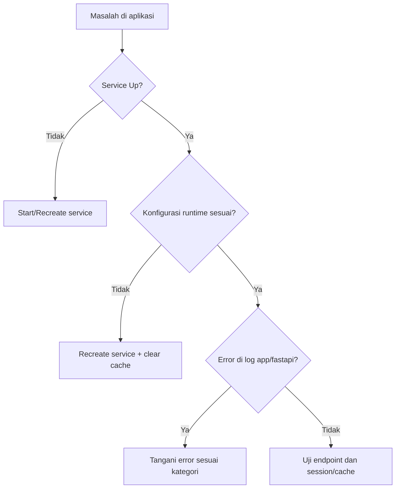

# Troubleshooting

Panduan ini disusun sebagai langkah investigasi berurutan agar debugging tidak muter di tempat.

## Quick Triage

1. Cek status service: `docker compose ps`
2. Cek log app: `docker compose logs --tail=200 app`
3. Cek log fastapi: `docker compose logs --tail=200 fastapi-risk`
4. Cek apakah perubahan env sudah masuk runtime

## Decision Flow



## Kasus: Harusnya CAPTCHA, tapi muncul lock 15 menit

### Gejala

Pesan: `Terlalu banyak percobaan login gagal. Coba lagi dalam 15 menit.`

### Pemeriksaan

```powershell
docker compose exec -T app sh -lc "printenv | grep -E '^(RATE_LIMIT_CHALLENGE|CAPTCHA_SITE_KEY|CAPTCHA_SECRET)=' || true"
```

```powershell
docker compose exec -T app php artisan tinker --execute="dump(config('security.rate_limit.challenge')); dump((string) config('services.captcha.site_key')); dump((string) config('services.captcha.secret'));"
```

### Perbaikan

```powershell
docker compose up -d --force-recreate app worker scheduler
docker compose exec -T app php artisan config:clear
docker compose exec -T app php artisan cache:clear
```

## Kasus: Nilai `.env` sudah benar, tapi aplikasi tidak berubah

Penyebab umum: env baru belum masuk container runtime.

Solusi:

1. Recreate service terkait (`--force-recreate`).
2. Clear cache config aplikasi.
3. Verifikasi lagi lewat `printenv` dan `config(...)`.

## Kasus: FastAPI timeout / risk scoring gagal

Pemeriksaan:

```bash
docker compose ps
docker compose logs --tail=200 fastapi-risk
```

Validasi URL/API key di Laravel:

- `AI_RISK_SERVICE_URL`
- `AI_RISK_API_KEY`

## Kasus: Artisan error `Class "Redis" not found`

Biasanya command dijalankan di host yang tidak punya extension Redis, bukan di container `app`.

Gunakan:

```bash
docker compose exec -T app php artisan <command>
```

## Matriks Error Ringkas

| Gejala | Kemungkinan Penyebab | Tindakan |
|---|---|---|
| Login selalu throttle | Mode runtime masih `throttle` | Recreate app/worker/scheduler, validasi runtime |
| `CAPTCHA_CONFIG_ERROR` | Site key/secret kosong atau salah | Isi env, recreate, clear cache |
| Widget captcha tidak tampil | Site key tidak tersedia atau flow belum `requires_captcha` | Cek runtime config + browser network |
| FastAPI health gagal | Service down/crash | Cek log fastapi, recreate service |
| Endpoint API 401 | Token hilang/invalid | Cek Authorization header dan session/token lifecycle |

## Perintah Diagnostik Umum

```bash
# status
docker compose ps

# logs
docker compose logs -f app
docker compose logs -f fastapi-risk

# route auth
docker compose exec -T app php artisan route:list | findstr /I auth
```
